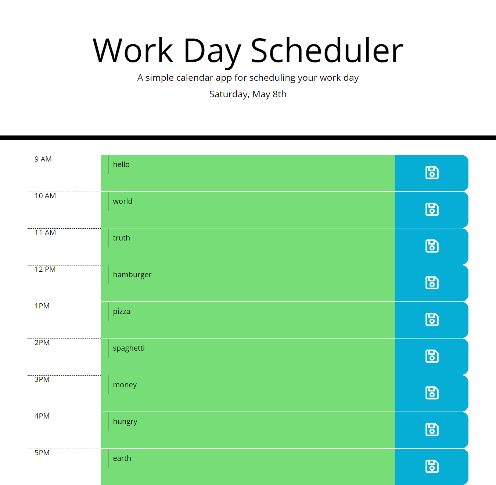

# 05-third-party-apis-work-day-scheduler

In this homework I build a work day scheduler. Code was provided this week for this homework so I used what they gave me which was essientially the HTMl and CSS. In this homework I built out all the functionality and dynamically created out the elements in jQuery. We also used moment JS to get the current time and date. The elements are dynamically populated and when a user writes something in the input and clicks the floppy disk save icon then that input value will save to local storage and even if your refresh the page the users input will still be there. Also depending on the time the div with the input will change colors dending if the time is past, present or in the future. 

- Created script.js file and used jQuery to dynamically build out all the elements on the page. 

- Used moment JS to get the current time and date. 

- Used local storage to save the value of the input from the user.

- Created conditional logic to see if the current time is present, past or future to the time on the scheduler and will be adding a differenct CSS class dependng on what it hits in the conditional logic.

# Screenshot
 

 

# Deployment Link

Below is the deployment github pages link.

[05-homework-deployment-link](https://itiskchengs.github.io/05-third-party-apis-work-day-scheduler/)